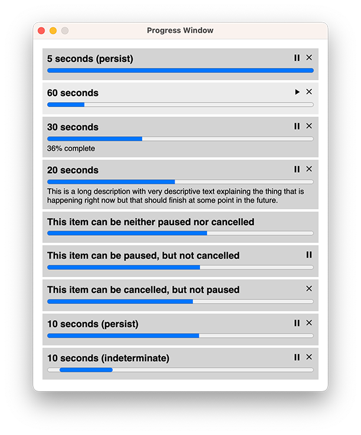

# electron-progress-window

Display multiple progress bars in an Electron window.

## Advantages

* Full Typescript support, including event types
* Zero runtime dependencies
* Full [documentation](docs/electron-progress-window.md)
* [Example](examples) playground to try it out in an Electron app 
* Progress bars are displayed in a single window (or multiple windows if you prefer)
* ProgressWindows and ProgressItems are event emitters
* Progress items can be added and removed dynamically
* Progress items can be updated dynamically
* Progress bars can be indeterminate (no value) or determinate (with value)
* Window can adjust size automatically as progress items are added and removed
* Automatically close window when all progress items are complete (or not)
* Configure default options for ProgressWindow and ProgressItem instances
* Choose whether individual progress bars are removed from window when complete
* Individual progress bars can be paused and resumed, sending 'pause' event
* Progress bars can be cancelled, sending 'will-cancel' and 'cancelled' event
* Ability to add custom CSS or HTML (in title or detail)
* Ability to fully customize the Electron BrowserWindow options
* Full test coverage



## Installation

```bash
npm install @spaceagetv/electron-progress-window
```

## Usage

```javascript
const { ProgressWindow } = require('@spaceagetv/electron-progress-window')

// Configure the settings for ProgressWindow
ProgressWindow.configure({
  closeOnComplete: true,
  focusWhenAddingItem: true,
  windowOptions: { // these are Electron BrowserWindow options
    title: 'Progress',
    width: 300,
    height: 60,
    backgroundColor: '#f00',
  },
})

async function somethingThatTakesTime(progressCallback) {
  const state = {
    paused: false,
    cancelled: false,
  }
  for (let i = 0; i < 100; i++) {
    while (state.paused && !state.cancelled) {
      await new Promise((resolve) => setTimeout(resolve, 100))
    }
    if (state.cancelled) {
      break
    }
    await new Promise((resolve) => setTimeout(resolve, 100))
    progressCallback(Math.round((i + 1) / 100 * 100))
  }
  const setPause = (isPaused) => {
    state.paused = isPaused
  }
  const cancel = () => {
    state.cancelled = true
  }
  return { setPause, cancel }
}

async function start() {
  const progressItem = await ProgressWindow.addItem({
    title: 'Something that takes time',
    detail: '0% complete',
    value: 0,
    maxValue: 100,
    enablePause: true,
    enableCancel: true,
  })

  const updateProgress = (progress) => {
    progressItem.setProgress(progress, {detail: `${progress}% complete`})
  }
  
  const { setPause, cancel } = await somethingThatTakesTime(updateProgress)

  progressItem.on('pause', (isPaused) => {
    setPause(isPaused)
  })
  progressItem.on('cancelled', () => {
    cancel()
  })
}

start()

```
