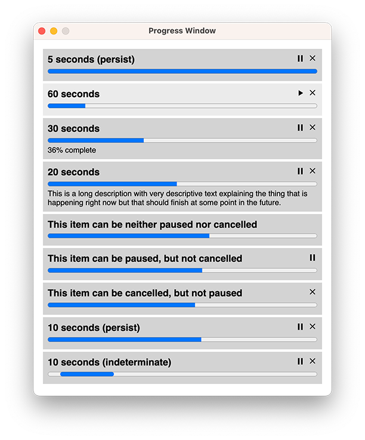

# electron-progress-window

Display multiple progress bars in an Electron window.

[](https://www.npmjs.com/package/@spaceagetv/electron-progress-window)
[](https://www.npmjs.com/package/@spaceagetv/electron-progress-window)
[](https://github.com/spaceagetv/electron-progress-window/actions/workflows/pull_request.yml)
[](https://opensource.org/licenses/MIT)
[](https://www.typescriptlang.org/)
[](https://nodejs.org/)

## Advantages

* Full Typescript support, including event types
* Zero runtime dependencies
* Full [documentation](docs/electron-progress-window.md)
* [Example](examples) playground to try it out in an Electron app 
* Progress bars are displayed in a single window (or multiple windows if you prefer)
* ProgressWindows and ProgressItems are event emitters
* Progress items can be added and removed dynamically
* Progress items can be updated dynamically
* Progress bars can be indeterminate (no value) or determinate (with value)
* Window can adjust size automatically as progress items are added and removed
* Automatically close window when all progress items are complete (or not)
* Configure default options for ProgressWindow and ProgressItem instances
* Choose whether individual progress bars are removed from window when complete
* Individual progress bars can be paused and resumed, sending 'pause' event
* Progress bars can be cancelled, sending 'will-cancel' and 'cancelled' event
* Ability to add custom CSS or HTML (in title or detail)
* Ability to fully customize the Electron BrowserWindow options
* Full test coverage



## Installation

```bash
npm install @spaceagetv/electron-progress-window
```

## Fonts and images in custom CSS

The progress page is loaded from a `data:` URL, which has an opaque origin.
Together with the window's `sandbox` and `webSecurity` settings, that means the
page cannot fetch subresources of any kind — not `file://`, not a relative
path, not a custom protocol registered by your app. Any `url()` in the `css`
option pointing at a file will silently fail to load.

Use `inlineAsset()` to embed the file in the stylesheet instead:

```javascript
const path = require('path')
const { ProgressWindow, inlineAsset } = require('@spaceagetv/electron-progress-window')

const brandFont = inlineAsset(path.join(__dirname, 'assets/brand.woff2'))

ProgressWindow.configure({
  css: `
    @font-face {
      font-family: 'Brand';
      src: url('${brandFont}') format('woff2');
    }
    html {
      --font-family: 'Brand', sans-serif;
    }
  `,
})
```

The media type is inferred from the file extension for common font and image
formats; pass it as a second argument for anything else.

Inlined assets end up in the page URL, so watch the total size — a full
variable font is roughly 75 KB of base64 before `encodeURIComponent` expands
`+`, `/` and `=`. Subsetting a font to the characters you actually use makes a
large difference.

## Theming

The window's colors, shadows and hover states are driven by CSS custom
properties. Pass a stylesheet through the `css` option, or set individual
properties per item with `cssVars` — see
[`itemCssMap`](docs/electron-progress-window.itemcssmap.md) for the full list of
what is configurable. Anything not covered there can still be overridden with an
ordinary CSS rule through the `css` option.

Design systems usually scope their token file to a selector such as
`[data-theme="dark"]` or `.theme-dark`. Use `htmlAttributes` or `bodyClass` to
put that selector on the progress page's root element, so the token file can be
injected verbatim instead of being rewritten:

```javascript
ProgressWindow.configure({
  htmlAttributes: { 'data-theme': 'dark' },
  // or: bodyClass: 'theme-dark',
  css: fs.readFileSync('./design-system/tokens.css', 'utf8'),
})
```

To flatten the default glossy progress bar:

```javascript
ProgressWindow.configure({
  css: `
    html {
      --progress-shadow: none;
      --indicator-shadow: none;
    }
  `,
})
```

## Usage

```javascript
const { ProgressWindow } = require('@spaceagetv/electron-progress-window')

// Configure the settings for ProgressWindow
ProgressWindow.configure({
  closeOnComplete: true,
  focusOnAdd: true,
  windowOptions: { // these are Electron BrowserWindow options
    title: 'Progress',
    width: 300,
    height: 60,
    backgroundColor: '#f00',
  },
})

async function somethingThatTakesTime(progressCallback) {
  const state = {
    paused: false,
    cancelled: false,
  }
  for (let i = 0; i < 100; i++) {
    while (state.paused && !state.cancelled) {
      await new Promise((resolve) => setTimeout(resolve, 100))
    }
    if (state.cancelled) {
      break
    }
    await new Promise((resolve) => setTimeout(resolve, 100))
    progressCallback(Math.round((i + 1) / 100 * 100))
  }
  const setPause = (isPaused) => {
    state.paused = isPaused
  }
  const cancel = () => {
    state.cancelled = true
  }
  return { setPause, cancel }
}

async function start() {
  const progressItem = await ProgressWindow.addItem({
    title: 'Something that takes time',
    detail: '0% complete',
    value: 0,
    maxValue: 100,
    pauseable: true,
    cancellable: true,
  })

  const updateProgress = (progress) => {
    progressItem.value = progress
    progressItem.detail = `${progress}% complete`
  }

  const { setPause, cancel } = await somethingThatTakesTime(updateProgress)

  progressItem.on('paused', (isPaused) => {
    setPause(isPaused)
  })
  progressItem.on('cancelled', () => {
    cancel()
  })
}

start()

```
